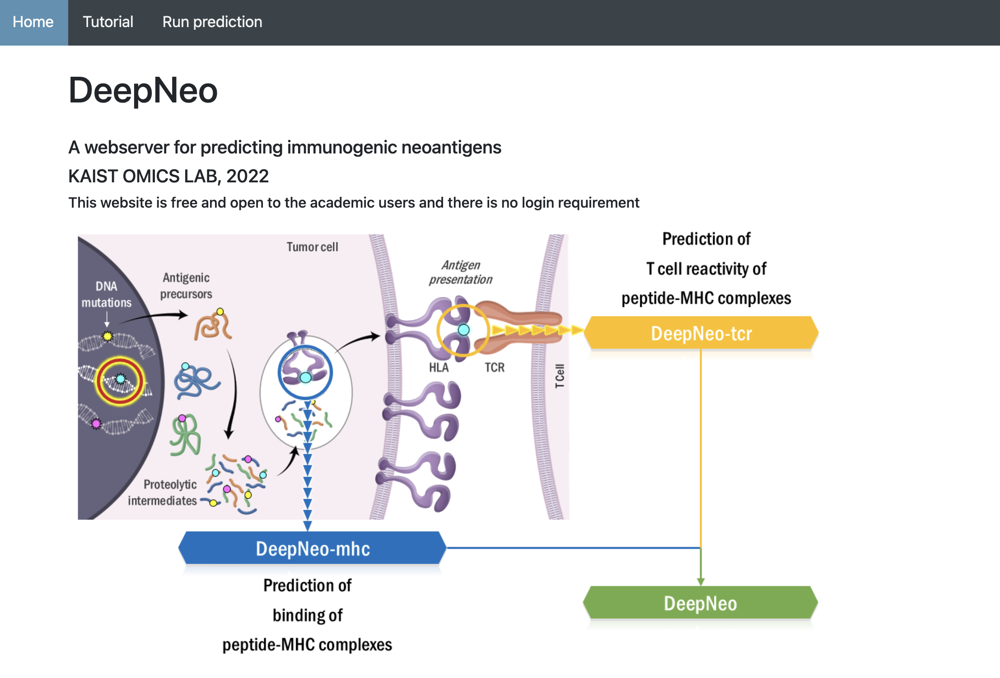

# DeepNeo
Designed to identify immunogenic neoepitopes
## DeepNeo is a tool for predicting the immunogenicity of peptide-MHC pairs as well as physical peptide-MHC binding.

Neoantigen, or peptides containing somatic mutations that are presented by MHC molecules, are known to be important in immunity. However, most neoantigen predicting tools only consider binding of peptide and MHC molecule regardless of T cell reactivity. Although MHC binding is necessary, it is not sufficient to elicit T cell response. To bridge this gap, we built a model that captures the structural properties of immunogenic peptide-MHC complexes using preferential amino acid interactions. DeepNeo supports prediction for two species, human and mouse, for both MHC class I and MHC class II.


References : 

“Predicting clinical benefit of immunotherapy by antigenic or functional mutations affecting tumour immunogenicity” Nature Communications (2020)

“MHC II immunogenicity shapes the neoepitope landscape in human tumors” Nature Genetics (2023)

"DeepNeo: a webserver for predicting immunogenic neoantigens" Nucleic Acids Research (2023)


## Update:  
**DeepNeo-v2 is now available as a webserver!**


**This repo provides source code only for DeepNeo-v1.**


**We recommend using DeepNeo-v2 webserver available at https://deepneo.net**





## Download and install:

Please download this github repo. This is for DeepNeo-v1 ONLY. Source code for DeepNeo-v2 is not provided.


The code can be run with Python=2.7 and Theano=1.0.4


If you are using conda, you can set up environment using deepneo.yml file.

Input file of the DeepNeo is three tab-separated file with HLA allele, peptide, and 0(for formatting purpose)

Example input file can be found on data/class1_input.dat


HLA alleles listed in data/All_prot_alignseq_369 can be predicted.


Peptides need to be in exact length (9mer for MHC I, 15mer for MHC II)

```
python make_dataset.py data/class1_input.dat class1 class1_input.dat.pkl.gz
python run_deepneo.py class1 mhc class1_input.dat.pkl.gz class1_mhcbinding_result.txt
python run_deepneo.py class1 tcr lass1_input.dat.pkl.gz class1_immunogenicity_result.txt
```

Peptides above threshold (>0.5 for MHC I and >0.7 for MHC II) for both MHC binding score and TCR reactivity score is considered immunogenic neoantigens
